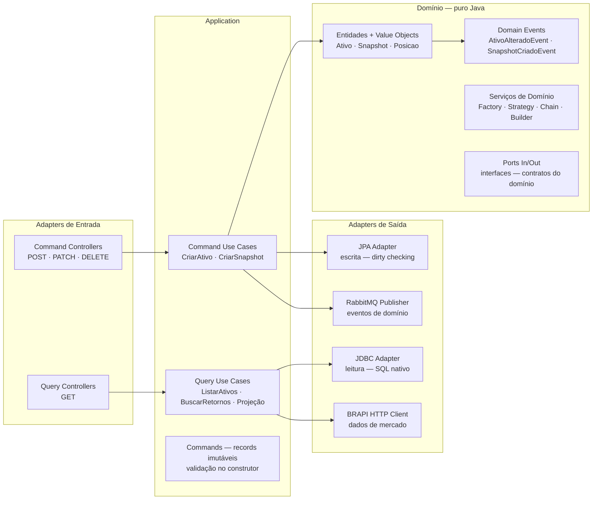
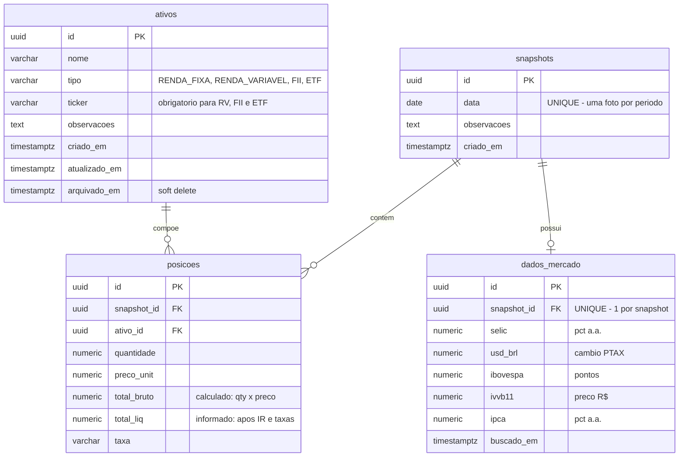

# Painel de Controle Financeiro

> Painel para acompanhamento de patrimônio, rendimentos históricos e projeções de crescimento.
> Projeto de portfólio demonstrando boas práticas de arquitetura, segurança e qualidade de código.


---

## Sobre o projeto

Sistema fullstack para controle financeiro pessoal com:

- **Gestão de ativos** — cadastro de renda fixa, variável, FIIs e ETFs com soft delete e publicação de eventos de domínio
- **Snapshots mensais** — fotografias do portfólio com validação em cadeia (Chain of Responsibility) e cálculo automático de `total_bruto`
- **Dados de mercado** — enriquecimento automático via BRAPI (Selic, câmbio, Ibovespa, IVVB11, IPCA); falha não bloqueia a criação do snapshot
- **Cálculos e projeções** — rendimento absoluto/percentual por período, concentração por tipo e projeção com juros compostos
- **Autenticação federada** — Keycloak como Identity Provider; Spring Boot valida JWT via JWKS sem gerenciar senhas

---

## Stack

### Backend

| Tecnologia | Versão | Papel |
|---|---|---|
| Java | 21 LTS | Linguagem principal |
| Spring Boot | 3.x | Framework base |
| Spring Security | 6.x | OAuth2 Resource Server — validação de JWT |
| Spring Data JPA | 3.x | Persistência — camada **Command** |
| JdbcTemplate | 6.x | Consultas SQL nativas — camada **Query** (CQRS) |
| Flyway | 10.x | Migrations versionadas — schema imutável em produção |
| RabbitMQ | 3.x | Mensageria — publicação de eventos de domínio (fire-and-forget) |
| Keycloak | 24 | Identity Provider OAuth2/OIDC |
| SpringDoc OpenAPI | 2.x | Swagger UI com autenticação bearer |
| Lombok | 1.18.x | Redução de boilerplate sem reflection em runtime |
| Testcontainers | — | Testes de integração com PostgreSQL real |

### Frontend

| Tecnologia | Versão | Papel |
|---|---|---|
| Angular | 19 | Framework SPA — padrão MVC |
| TypeScript | 5.x | Linguagem principal |
| Bootstrap | 5.x | Layout Mobile First |
| Keycloak JS Adapter | — | Login OIDC — token em memória, injetado via interceptor |
| Chart.js | — | Gráficos de projeção e concentração de portfólio |

### Infraestrutura

| Tecnologia | Papel |
|---|---|
| Docker + Compose | Orquestração completa — um comando sobe tudo |
| Nginx | Serve o Angular e faz proxy reverso `/api/` → backend |
| PostgreSQL 16 | Banco de dados relacional |

---

## Arquitetura

### Hexagonal + Clean Architecture + CQRS

O domínio é **puro Java** — zero dependências de framework. A separação explícita entre **Command** (escrita) e **Query** (leitura) é o ponto central da arquitetura.

```
Regra: domain/ não importa Spring, JPA, JDBC nem framework algum.
       Persistência, mensageria e HTTP são detalhes de infraestrutura.
```

#### Por que JDBC na camada Query?

A leitura usa `JdbcTemplate` com SQL nativo — não JPA. Essa decisão é intencional e resolve um problema real de performance:

| Aspecto | JPA (evitado nas queries) | JDBC (adotado nas queries) |
|---|---|---|
| Carregamento | Hidrata entidades completas com todos os campos | Projeta só as colunas necessárias |
| Joins | Gera N queries ou `JOIN FETCH` verboso | SQL único e explícito, otimizável |
| Mapeamento | Passa pelo domínio antes de chegar ao DTO | `RowMapper` → DTO direto, sem entidade intermediária |
| Controle | ORM decide o SQL gerado | Desenvolvedor controla índices, aliases e projeções |
| Custo em leitura | Overhead de dirty checking e first-level cache | Execução direta — sem estado gerenciado |

Na prática, cada `QueryController` chama um `QueryUseCase` que delega para um `JdbcQueryAdapter` — o SQL retorna direto o `record` de resposta, sem passar pelo domínio:

```
GET /api/snapshots/{id}
  └─▶ BuscarSnapshotUseCase
        └─▶ SnapshotJdbcQueryAdapter
              └─▶ SQL com JOIN snapshots ↔ posicoes ↔ ativos
                    └─▶ SnapshotResponse (record) — resposta pronta
```

A escrita continua usando JPA porque ali o dirty checking e o gerenciamento de ciclo de vida das entidades são vantagens reais (transação, cascata, auditoria de `atualizado_em`).



### Estrutura de pacotes

```
src/main/java/.../controleFinanceiro/
├── domain/
│   ├── model/              ← Entidades + Value Objects (puro Java)
│   ├── event/              ← AtivoAlteradoEvent, SnapshotCriadoEvent
│   ├── port/
│   │   ├── in/command/     ← CriarAtivoPort, CriarSnapshotPort...
│   │   ├── in/query/       ← ListarAtivosPort, BuscarSnapshotPort...
│   │   └── out/            ← AtivoRepositoryPort, EventPublisherPort...
│   ├── service/            ← AtivoValidatorFactory, ReturnCalculationStrategy
│   └── exception/          ← DomainException, NotFoundException, ConflictException
│
├── application/
│   ├── usecase/
│   │   ├── command/        ← CriarAtivoUseCase, CriarSnapshotUseCase...
│   │   └── query/          ← ListarAtivosUseCase, BuscarRetornosUseCase...
│   └── dto/
│       ├── request/        ← DTOs de entrada com Bean Validation
│       └── response/       ← records com factory method from()
│
└── infrastructure/
    ├── adapter/in/rest/
    │   ├── command/        ← AtivoCommandController, SnapshotCommandController
    │   └── query/          ← AtivoQueryController, SnapshotQueryController, MercadoQueryController
    ├── adapter/out/
    │   ├── persistence/    ← JPA entities + repositories + command adapters
    │   ├── query/          ← JDBC adapters + RowMappers
    │   ├── messaging/      ← RabbitEventPublisher
    │   └── external/       ← BrapiHttpClient
    ├── config/             ← SecurityConfig, SwaggerConfig, RabbitConfig
    └── exception/          ← GlobalExceptionHandler
```

---

## Padrões de projeto aplicados

| Padrão | Implementação | Problema resolvido |
|---|---|---|
| **Factory** | `AtivoValidatorFactory` | Seleciona o validador correto pelo tipo do ativo — evita if/else no use case |
| **Strategy** | `ReturnCalculationStrategy` | Troca o algoritmo de retorno (simples vs CAGR) via query param, sem condicional |
| **Builder** | `Snapshot.Builder` | Monta o agregado em etapas; `build()` centraliza toda validação de invariantes |
| **Command** | `CriarAtivoCommand`, `CriarSnapshotCommand` | Encapsula intenção como objeto imutável — validado antes de entrar no domínio |
| **Chain of Responsibility** | `SnapshotValidationChain` | Cadeia de validações independentes antes de persistir: data única → ativos ativos → sem duplicatas |

> **Mapeamento sem MapStruct:** DTOs de resposta são `record` com factory method estático `from(Entity)`. Código explícito, auditável e sem reflection em runtime.

---

## Modelo de dados



---

## Segurança

**Fluxo OAuth2 / OIDC:**

```
Angular ──login──▶ Keycloak ──JWT──▶ Spring Boot (valida via JWKS endpoint)
```

- Spring Boot é **Resource Server** — nunca armazena senhas
- Roles extraídas de `realm_access.roles` no JWT com prefixo `ROLE_`
- Rate limiting via Nginx: **7 req/min por IP** (≈ 100/15 min) com burst de 20

| Rota | Acesso |
|---|---|
| `GET /api/health`, `/docs/**`, `/v3/api-docs/**` | Público |
| `GET /api/**` | VIEWER + ADMIN (JWT válido) |
| `POST · PATCH · DELETE /api/**` | ADMIN (JWT válido + role ADMIN) |

---

## Endpoints da API

| Método | Rota | Role | Descrição |
|---|---|---|---|
| GET | `/api/health` | Público | Status da aplicação e do banco |
| GET | `/api/assets` | VIEWER | Lista ativos não arquivados (JDBC) |
| GET | `/api/assets/{id}` | VIEWER | Busca ativo por ID (JDBC) |
| POST | `/api/assets` | ADMIN | Cria ativo + publica evento RabbitMQ |
| PATCH | `/api/assets/{id}` | ADMIN | Atualiza ativo + publica evento |
| DELETE | `/api/assets/{id}` | ADMIN | Arquiva ativo (soft delete) |
| GET | `/api/snapshots` | VIEWER | Lista snapshots resumidos (JDBC) |
| GET | `/api/snapshots/latest` | VIEWER | Snapshot mais recente completo |
| GET | `/api/snapshots/{id}` | VIEWER | Snapshot por ID |
| GET | `/api/snapshots/{id}/returns?mode=simple\|cagr` | VIEWER | Rendimento por período — Strategy pattern |
| GET | `/api/snapshots/{id}/allocation` | VIEWER | Concentração por tipo (SQL GROUP BY) |
| GET | `/api/snapshots/latest/projection?rate=X&months=Y` | VIEWER | Projeção com juros compostos |
| POST | `/api/snapshots` | ADMIN | Cria snapshot + dados de mercado + evento |
| GET | `/api/market` | VIEWER | Indicadores ao vivo via BRAPI |
| GET | `/api/market/tesouro` | VIEWER | Taxas do Tesouro Direto |

> Todas as respostas seguem o envelope `{ "success": true, "data": {...}, "message": "..." }`.
> Erros retornam `{ "success": false, "error": { "code": "...", "statusCode": ... } }`.

---

## Como executar

### Pré-requisitos

| Ferramenta | Versão mínima |
|---|---|
| Docker Desktop | 4.x |
| Docker Compose | 2.x (incluído no Desktop) |
| Git | — |

> **Windows:** instale o WSL 2 antes do Docker Desktop.
> ```powershell
> # PowerShell como Administrador
> wsl --install && wsl --set-default-version 2
> ```

### Subida completa (produção local)

```bash
git clone https://github.com/rockgustavo/controleFinanceiroSpring.git
cd controleFinanceiroSpring
cp .env.example .env
docker compose up --build
# Aguarde ~60s no primeiro build — Keycloak importa o realm automaticamente
```

| Serviço | URL |
|---|---|
| Frontend | http://localhost |
| API / Swagger | http://localhost:8080/docs |
| Keycloak Admin | http://localhost:8180 |
| RabbitMQ Management | http://localhost:15672 |

### Desenvolvimento local

```bash
# Terminal 1 — infraestrutura
docker compose up -d postgres keycloak rabbitmq

# Terminal 2 — backend (hot reload)
mvn spring-boot:run -Dspring-boot.run.profiles=dev

# Terminal 3 — frontend (hot reload)
cd ../controleFinanceiroAng && ng serve --open
```

Acessos locais: **Frontend** http://localhost:4200 · **Swagger** http://localhost:8080/docs

### Credenciais de desenvolvimento

| Usuário | Senha | Role |
|---|---|---|
| `admin@financeiro.dev` | `admin123` | ADMIN — acesso completo |
| `viewer@financeiro.dev` | `viewer123` | VIEWER — somente leitura |
| Keycloak admin | `admin` | Console de administração |
| RabbitMQ | `guest` / `guest` | Painel de gestão |
| PostgreSQL | `financeiro` / `financeiro` | Banco `financeiro` |

---

## Testes

```bash
# Unitários — domain, use cases, validações, chain handlers
mvn test

# Integração — Testcontainers sobe PostgreSQL real
mvn verify
```

**Cobertura:** 119 testes · 0 falhas · domain 90%+ · use cases 80%+

Camadas cobertas:

- Entidades e value objects (`Ativo`, `Posicao`, `Snapshot`)
- Validators e Factory (`AtivoValidatorFactory`, `TickerObrigatorioValidator`)
- Chain of Responsibility (`DataUnicaHandler`, `AtivosAtivosHandler`, `SemPosicoeDuplicadaHandler`)
- Use cases de comando e consulta (ativos, snapshots, mercado, projeção)
- Controllers com `@WebMvcTest` + cenários de autenticação 401/403
- Repositório com Testcontainers (`AtivoRepositoryIntegrationTest`)

---

## Decisões técnicas

| Decisão | Motivação |
|---|---|
| **CQRS com JDBC nas queries** | SQL nativo otimizado — sem overhead do JPA, joins e projeções controlados |
| **Factory method no lugar do MapStruct** | Mapeamento explícito e rastreável — zero reflection em runtime |
| **Keycloak como IdP** | Sistema não gerencia senhas — delegação total da autenticação |
| **JWT stateless** | Sem sessão no servidor — escalabilidade horizontal sem sticky session |
| **Soft delete em ativos** | Preserva integridade histórica dos snapshots — ativo arquivado permanece nas fotos antigas |
| **RabbitMQ fire-and-forget** | Falha de publicação é logada mas não quebra a transação principal |
| **Flyway em ambos os ambientes** | Schema versionado — `ddl-auto: validate` evita surpresas em produção |
| **Dockerfile multi-stage** | Imagem final mínima — só JRE e o JAR, sem Maven nem código fonte |
| **Chain of Responsibility para snapshot** | Validações independentes e extensíveis — adicionar nova regra é adicionar um handler |
